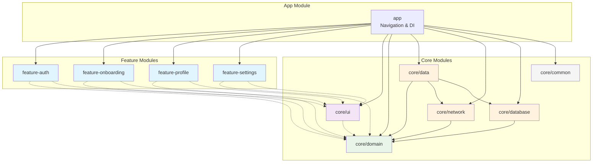

# Modularization Guide

Based on our modern Android multi-module architecture with Navigation3, Jetpack Compose, and strict dependency rules.
All Kotlin code in this guide must align with `references/kotlin-patterns.md`.

## Table of Contents
1. [Benefits](#benefits)
2. [Module Types](#module-types)
3. [Module Structure](#module-structure)
4. [Dependency Rules](#dependency-rules)
5. [Creating Modules](#creating-modules)
6. [Navigation Coordination](#navigation-coordination)
7. [Build Configuration](#build-configuration)

## Benefits

- **Scalability**: Changes in one module don't cascade to others
- **Parallel development**: Teams work independently on different features
- **Build speed**: Incremental builds only recompile changed modules
- **Reusability**: Core modules can be shared across apps
- **Encapsulation**: Clear boundaries and visibility controls
- **Testability**: Each module can be tested in isolation
- **Feature Independence**: Features don't depend on each other
- **Navigation Centralization**: App module coordinates all navigation
- **Adaptive UI Support**: Navigation3 enables responsive designs across form factors

## Module Types

### App Module (`app/`)
Entry point that brings everything together with Navigation3 adaptive navigation.

**Contains**:
- `MainActivity` with `NavigationSuiteScaffold`
- `AppNavigation` composable with `windowAdaptiveInfo`
- `NavigationState` and `Navigator` for state management
- `entryProvider` with all feature destinations
- `NavDisplay` to render current destination
- `Navigator` implementations for feature coordination
- Hilt DI setup and component

**Dependencies**: All feature modules, all core modules

### Feature Modules (`feature/*`)
Self-contained features with clear boundaries and no inter-feature dependencies.

```
feature-auth/
├── build.gradle.kts
├── src/main/
│   ├── kotlin/com/example/feature/auth/
│   │   ├── presentation/              # UI Layer
│   │   │   ├── AuthScreen.kt          # Main composable
│   │   │   ├── AuthRoute.kt           # Navigation setup
│   │   │   ├── viewmodel/             
│   │   │   │   ├── AuthViewModel.kt   # State holder
│   │   │   │   ├── AuthUiState.kt     # UI state models
│   │   │   │   └── AuthActions.kt     # User actions
│   │   │   └── components/            # Smaller UI components
│   │   ├── navigation/                # Navigation Layer
│   │   │   ├── AuthDestination.kt     # Feature routes (@Immutable NavKey)
│   │   │   ├── AuthNavigator.kt       # Navigation interface
│   │   │   └── AuthGraph.kt           # EntryProviderScope extension
│   │   └── domain/                    # Optional: Feature-specific domain
│   │       ├── repository/
│   │       └── usecase/
│   └── res/                          # Feature resources
```

### Core Modules (`core/`)
Shared library code used across features with strict dependency direction.

| Module           | Purpose                                         | Dependencies                                        | Key Classes                                                                            |
|------------------|-------------------------------------------------|-----------------------------------------------------|----------------------------------------------------------------------------------------|
| `core:domain`    | Domain models, use cases, repository interfaces | None (pure Kotlin)                                  | `AuthToken`, `User`, `LoginUseCase`, `AuthRepository` interface                        |
| `core:data`      | Repository implementations, data coordination   | `core:domain`                                       | `AuthRepositoryImpl`, `AuthRemoteDataSource`, `AuthLocalDataSource`                    |
| `core:database`  | Room database, DAOs, entities                   | `core:model` (if separate), otherwise `core:domain` | `AuthDatabase`, `AuthTokenDao`, `UserEntity`                                           |
| `core:network`   | Retrofit API, network models                    | `core:model` (if separate), otherwise `core:domain` | `AuthApi`, `NetworkAuthResponse`                                                       |
| `core:datastore` | Proto DataStore preferences                     | None                                                | `AuthPreferencesDataSource`                                                            |
| `core:common`    | Shared utilities, extensions                    | None                                                | `AppDispatchers`, `ResultExtensions`                                                   |
| `core:ui`        | Reusable UI components, themes, base ViewModels | `core:domain` (optional)                            | `AuthForm`, `AuthTheme`, `BaseViewModel`                                               |
| `core:testing`   | Test utilities, test doubles                    | Depends on module being tested                      | `TestDispatcherRule`, `FakeAuthRepository`                                             |

## Module Structure

### Complete Project Structure

```
app/                    # App module - navigation, DI setup, app entry point
feature/
  ├── feature-auth/       # Authentication feature
  ├── feature-onboarding/ # Signup and onboarding flow
  ├── feature-profile/    # User profile feature
  ├── feature-settings/   # App settings feature
  └── feature-<name>/     # Additional features...
core/
  ├── domain/           # Pure Kotlin: Use Cases, Repository interfaces, Domain models
  ├── data/             # Data layer: Repository impl, DataSources, Data models
  ├── ui/               # Shared UI components, themes, base ViewModels
  ├── network/          # Retrofit, API models, network utilities
  ├── database/         # Room DAOs, entities, migrations
  ├── datastore/        # Preferences storage
  ├── common/           # Shared utilities, extensions
  └── testing/          # Test utilities, test doubles
build-logic/            # Convention plugins for consistent builds
├── convention/
│   ├── src/main/kotlin/
│   │   ├── AndroidApplicationConventionPlugin.kt # App module
│   │   ├── AndroidLibraryConventionPlugin.kt     # Core library modules
│   │   ├── AndroidFeatureConventionPlugin.kt     # Feature modules
│   │   ├── AndroidComposeConventionPlugin.kt     # Compose setup
│   │   ├── AndroidHiltConventionPlugin.kt        # Hilt setup
│   │   └── AndroidRoomConventionPlugin.kt        # Room setup
│   └── build.gradle.kts
```

### Feature Module Structure

```
feature-auth/
├── build.gradle.kts
├── src/main/
│   ├── kotlin/com/example/feature/auth/
│   │   ├── presentation/              # Presentation Layer
│   │   │   ├── AuthScreen.kt          # Main composable
│   │   │   ├── AuthRoute.kt           # Feature route composable
│   │   │   ├── viewmodel/             
│   │   │   │   ├── AuthViewModel.kt   # State holder
│   │   │   │   ├── AuthUiState.kt     # UI state models
│   │   │   │   └── AuthActions.kt     # User actions
│   │   │   └── components/            # Feature-specific UI components
│   │   │       ├── AuthFormCard.kt
│   │   │       └── AuthHeader.kt
│   │   ├── navigation/                # Navigation Layer
│   │   │   ├── AuthDestination.kt     # Feature routes (sealed class)
│   │   │   ├── AuthNavigator.kt       # Navigation interface
│   │   │   └── AuthGraph.kt           # NavGraphBuilder extension
│   │   └── di/                        # Feature-specific DI
│   │       └── AuthModule.kt          # Hilt module
│   └── res/                          # Feature resources
│       ├── drawable/
│       └── values/
└── src/test/                         # Feature tests
    └── kotlin/com/example/feature/auth/
        ├── presentation/viewmodel/
        │   └── AuthViewModelTest.kt
        └── navigation/
            └── AuthDestinationTest.kt
```

### Core Module Structure

```
core/domain/
├── build.gradle.kts
├── src/main/kotlin/com/example/core/domain/
│   ├── model/                         # Domain models
│   │   ├── User.kt
│   │   ├── AuthToken.kt
│   │   └── AuthState.kt
│   ├── repository/                    # Repository interfaces
│   │   └── AuthRepository.kt
│   ├── usecase/                       # Use cases
│   │   ├── LoginUseCase.kt
│   │   ├── RegisterUseCase.kt
│   │   ├── ResetPasswordUseCase.kt
│   │   └── ObserveAuthStateUseCase.kt
│   └── di/                           # Domain DI (if needed)
│       └── DomainModule.kt
└── src/test/kotlin/com/example/core/domain/
    ├── model/
    └── usecase/
```

## Dependency Rules

### Allowed Dependencies

```
feature/* → core/domain → core/data
    ↓                       ↓
core/ui (optional)       (no circular dependencies)

app → all feature modules (for navigation coordination)
app → all core modules (for DI setup)

NO feature-to-feature dependencies allowed
```

### Strict Rules:
1. **Feature modules can only depend on Core modules**
2. **Feature modules cannot depend on other feature modules**
3. **Core/Domain has no Android dependencies** (pure Kotlin)
4. **Core/Data depends on Core/Domain** (implements interfaces)
5. **Core/UI is optional** for features that need shared UI components
6. **App module depends on all features** for navigation coordination
7. **No circular dependencies** between any modules

### Visual Dependency Graph



## Creating Modules

### 1. Create Feature Module

**Step 1: Create directory structure**
```
mkdir -p feature-auth/src/main/kotlin/com/example/feature/auth/{presentation/{viewmodel,components},navigation,di}
mkdir -p feature-auth/src/test/kotlin/com/example/feature/auth
```

**Step 2: Configure build.gradle.kts**
Use the Feature Module build file template in `references/gradle-setup.md`.
It includes the feature convention plugins, core module dependencies, Navigation3,
and test bundles.

**Step 3: Register in settings.gradle.kts**
```kotlin
include(":feature-auth")
```

**Step 4: Create navigation components**
```kotlin
// feature-auth/navigation/AuthDestination.kt
import androidx.compose.runtime.Immutable
import androidx.navigation3.runtime.NavKey
import kotlinx.serialization.Serializable

@Immutable
sealed interface AuthDestination : NavKey {
    @Serializable
    data object Login : AuthDestination
    
    @Serializable
    data object Register : AuthDestination
    
    @Serializable
    data object ForgotPassword : AuthDestination
    
    @Serializable
    data class Profile(val userId: String) : AuthDestination
}

// feature-auth/navigation/AuthNavigator.kt
interface AuthNavigator {
    fun navigateToRegister()
    fun navigateToForgotPassword()
    fun navigateBack()
    fun navigateToProfile(userId: String)
    fun navigateToMainApp()
}

// feature-auth/navigation/AuthGraph.kt
import androidx.navigation3.runtime.EntryProviderScope
import androidx.navigation3.runtime.NavKey

fun EntryProviderScope<NavKey>.authGraph(
    authNavigator: AuthNavigator
) {
    entry<AuthDestination.Login> {
        LoginScreen(
            onLoginSuccess = { user ->
                authNavigator.navigateToMainApp()
            },
            onRegisterClick = {
                authNavigator.navigateToRegister()
            },
            onForgotPasswordClick = {
                authNavigator.navigateToForgotPassword()
            }
        )
    }
    
    entry<AuthDestination.Register> {
        RegisterScreen(
            onRegisterSuccess = { user ->
                authNavigator.navigateToMainApp()
            },
            onNavigateToLogin = {
                authNavigator.navigateBack()
            }
        )
    }
    
    entry<AuthDestination.ForgotPassword> {
        ForgotPasswordScreen(
            onResetSuccess = {
                authNavigator.navigateBack()
            },
            onNavigateBack = {
                authNavigator.navigateBack()
            }
        )
    }
    
    entry<AuthDestination.Profile> { key ->
        ProfileScreen(
            userId = key.userId,
            onNavigateBack = {
                authNavigator.navigateBack()
            }
        )
    }
}
```

### 2. Create Core Module

**Step 1: Create directory structure**
```
mkdir -p core/domain/src/main/kotlin/com/example/core/domain/{model,repository,usecase}
mkdir -p core/domain/src/test/kotlin/com/example/core/domain
```

**Step 2: Configure build.gradle.kts**
Use the Core Domain module build file template in `references/gradle-setup.md`.
It keeps the module pure Kotlin and includes serialization and test dependencies.

**Step 3: Create domain models and contracts**

Define domain models, repository interfaces, and use cases in `core/domain`.
For detailed patterns and examples, see the Domain Layer section in
`references/architecture.md`.

### 3. Create App Module Configuration

**Step 1: Configure app module dependencies**
Use the App module build file template in `references/gradle-setup.md`.
It includes feature/core module wiring, Navigation3, and DI configuration.

**Step 2: Create navigation state and navigator**

Create `NavigationState.kt` and `Navigator.kt` for managing app navigation state.
See Navigation Coordination section below for complete implementation.

**Step 3: Create app navigation**
```kotlin
// app/src/main/kotlin/com/example/app/navigation/AppNavigation.kt
import androidx.compose.material3.adaptive.ExperimentalMaterial3AdaptiveApi
import androidx.compose.material3.adaptive.currentWindowAdaptiveInfo
import androidx.compose.material3.adaptive.navigationsuite.NavigationSuiteScaffold
import androidx.compose.runtime.Composable
import androidx.compose.runtime.LaunchedEffect
import androidx.compose.runtime.remember
import androidx.compose.ui.Modifier
import androidx.compose.ui.res.painterResource
import androidx.navigation3.runtime.NavKey
import androidx.navigation3.runtime.entryProvider
import androidx.navigation3.ui.NavDisplay
import kotlinx.serialization.Serializable

@Immutable
sealed interface TopLevelRoute : NavKey {
    @Serializable data object Auth : TopLevelRoute
    @Serializable data object Profile : TopLevelRoute
    @Serializable data object Settings : TopLevelRoute
}

@OptIn(ExperimentalMaterial3AdaptiveApi::class)
@Composable
fun AppNavigation(
    analytics: Analytics
) {
    val windowAdaptiveInfo = currentWindowAdaptiveInfo()
    
    // Create navigation state (survives config changes and process death)
    val navigationState = rememberNavigationState(
        startRoute = TopLevelRoute.Auth,
        topLevelRoutes = setOf(
            TopLevelRoute.Auth,
            TopLevelRoute.Profile,
            TopLevelRoute.Settings
        )
    )
    
    val navigator = remember(navigationState) { Navigator(navigationState) }
    
    // Track screen views for analytics/crashlytics
    LaunchedEffect(navigationState.topLevelRoute) {
        val currentStack = navigationState.backStacks[navigationState.topLevelRoute]
        val currentRoute = currentStack?.last()
        currentRoute?.let { route ->
            analytics.logScreenView(
                screenName = route::class.simpleName ?: "Unknown",
                screenClass = "MainActivity"
            )
        }
    }
    
    // Create navigator implementations
    val authNavigator = remember(navigator) {
        object : AuthNavigator {
            override fun navigateToRegister() = navigator.navigate(AuthDestination.Register)
            override fun navigateToForgotPassword() = navigator.navigate(AuthDestination.ForgotPassword)
            override fun navigateBack() = navigator.goBack()
            override fun navigateToProfile(userId: String) = navigator.navigate(AuthDestination.Profile(userId))
            override fun navigateToMainApp() = navigator.navigate(TopLevelRoute.Profile)
        }
    }
    
    // Define all app destinations
    val entryProvider = entryProvider {
        authGraph(authNavigator)
        profileGraph()
        settingsGraph()
    }
    
    NavigationSuiteScaffold(
        windowAdaptiveInfo = windowAdaptiveInfo,
        navigationSuiteItems = {
            item(
                icon = { Icon(painterResource(R.drawable.ic_lock), contentDescription = null) },
                label = { Text("Auth") },
                selected = navigationState.topLevelRoute == TopLevelRoute.Auth,
                onClick = { navigator.navigate(TopLevelRoute.Auth) }
            )
            item(
                icon = { Icon(painterResource(R.drawable.ic_person), contentDescription = null) },
                label = { Text("Profile") },
                selected = navigationState.topLevelRoute == TopLevelRoute.Profile,
                onClick = { navigator.navigate(TopLevelRoute.Profile) }
            )
            item(
                icon = { Icon(painterResource(R.drawable.ic_settings), contentDescription = null) },
                label = { Text("Settings") },
                selected = navigationState.topLevelRoute == TopLevelRoute.Settings,
                onClick = { navigator.navigate(TopLevelRoute.Settings) }
            )
        }
    ) {
        NavDisplay(
            entries = navigationState.toEntries(entryProvider),
            onBack = { navigator.goBack() },
            modifier = Modifier.fillMaxSize()
        )
    }
}
```

**Icon Resources**: See `references/android-graphics.md` for complete guidance on:
- Material Symbols icons (download via Iconify API or Google Fonts)
- ImageVector patterns for programmatic icons
- Custom drawing with Canvas
- Performance optimizations

**Quick example:**
```kotlin
// Download icon
curl -o app/src/main/res/drawable/ic_lock.xml \
  "https://api.iconify.design/material-symbols:lock.svg?download=true"

// Usage
Icon(
    painter = painterResource(R.drawable.ic_lock),
    contentDescription = stringResource(R.string.lock_icon)
)
```

**Analytics Integration**: Inject `Analytics` interface (from `references/crashlytics.md`) instead of using Firebase directly. This provides abstraction for crash reporting and analytics.

## Navigation Coordination

### Key Principles

1. **Feature Independence**: Features define `Navigator` interfaces
2. **Central Coordination**: App module implements all navigators
3. **Type-Safe Routes**: Routes implement `NavKey` with `@Serializable` and `@Immutable`
4. **Explicit State Management**: `NavigationState` + `Navigator` manage navigation state
5. **Adaptive Navigation**: `NavigationSuiteScaffold` adapts based on `windowAdaptiveInfo`

### Navigation Flow

For end-to-end flow diagrams (UI → data → navigation), see the Complete Architecture
Flow section in `references/architecture.md`.

### Navigation 3 State Management

Navigation 3 uses explicit state management with Unidirectional Data Flow:

**1. NavigationState** - Holds current route and back stacks:
```kotlin
// Copy this into NavigationState.kt in your app module
import androidx.compose.runtime.Composable
import androidx.compose.runtime.MutableState
import androidx.compose.runtime.getValue
import androidx.compose.runtime.mutableStateOf
import androidx.compose.runtime.remember
import androidx.compose.runtime.saveable.rememberSerializable
import androidx.compose.runtime.setValue
import androidx.compose.runtime.snapshots.SnapshotStateList
import androidx.compose.runtime.toMutableStateList
import androidx.navigation3.runtime.NavBackStack
import androidx.navigation3.runtime.NavEntry
import androidx.navigation3.runtime.NavKey
import androidx.navigation3.runtime.rememberDecoratedNavEntries
import androidx.navigation3.runtime.rememberNavBackStack
import androidx.navigation3.runtime.rememberSaveableStateHolderNavEntryDecorator
import androidx.navigation3.runtime.serialization.NavKeySerializer
import androidx.savedstate.compose.serialization.serializers.MutableStateSerializer

@Composable
fun rememberNavigationState(
    startRoute: NavKey,
    topLevelRoutes: Set<NavKey>
): NavigationState {
    val topLevelRoute = rememberSerializable(
        startRoute, topLevelRoutes,
        serializer = MutableStateSerializer(NavKeySerializer())
    ) {
        mutableStateOf(startRoute)
    }

    val backStacks = topLevelRoutes.associateWith { key -> rememberNavBackStack(key) }

    return remember(startRoute, topLevelRoutes) {
        NavigationState(
            startRoute = startRoute,
            topLevelRoute = topLevelRoute,
            backStacks = backStacks
        )
    }
}

class NavigationState(
    val startRoute: NavKey,
    topLevelRoute: MutableState<NavKey>,
    val backStacks: Map<NavKey, NavBackStack<NavKey>>
) {
    var topLevelRoute: NavKey by topLevelRoute
    val stacksInUse: List<NavKey>
        get() = if (topLevelRoute == startRoute) {
            listOf(startRoute)
        } else {
            listOf(startRoute, topLevelRoute)
        }
}

@Composable
fun NavigationState.toEntries(
    entryProvider: (NavKey) -> NavEntry<NavKey>
): SnapshotStateList<NavEntry<NavKey>> {
    val decoratedEntries = backStacks.mapValues { (_, stack) ->
        val decorators = listOf(
            rememberSaveableStateHolderNavEntryDecorator<NavKey>(),
        )
        rememberDecoratedNavEntries(
            backStack = stack,
            entryDecorators = decorators,
            entryProvider = entryProvider
        )
    }

    return stacksInUse
        .flatMap { decoratedEntries[it] ?: emptyList() }
        .toMutableStateList()
}
```

**2. Navigator** - Modifies navigation state:
```kotlin
// Copy this into Navigator.kt in your app module
import androidx.navigation3.runtime.NavKey

class Navigator(val state: NavigationState) {
    fun navigate(route: NavKey) {
        if (route in state.backStacks.keys) {
            // This is a top level route, just switch to it.
            state.topLevelRoute = route
        } else {
            state.backStacks[state.topLevelRoute]?.add(route)
        }
    }

    fun goBack() {
        val currentStack = state.backStacks[state.topLevelRoute] ?:
            error("Stack for ${state.topLevelRoute} not found")
        val currentRoute = currentStack.last()

        // If we're at the base of the current route, go back to the start route stack.
        if (currentRoute == state.topLevelRoute) {
            state.topLevelRoute = state.startRoute
        } else {
            currentStack.removeLastOrNull()
        }
    }
}
```

**3. Feature Navigator Interface**:
```kotlin
// feature-auth/navigation/AuthNavigator.kt
interface AuthNavigator {
    fun navigateToRegister()
    fun navigateToForgotPassword()
    fun navigateBack()
    fun navigateToProfile(userId: String)
    fun navigateToMainApp()
}

// In App module implementation:
val authNavigator = remember(navigator) {
    object : AuthNavigator {
        override fun navigateToRegister() = navigator.navigate(AuthDestination.Register)
        override fun navigateToForgotPassword() = navigator.navigate(AuthDestination.ForgotPassword)
        override fun navigateBack() = navigator.goBack()
        override fun navigateToProfile(userId: String) = navigator.navigate(AuthDestination.Profile(userId))
        override fun navigateToMainApp() = navigator.navigate(TopLevelRoute.Profile)
    }
}
```

**Architecture principles:** These classes follow Unidirectional Data Flow:
- The `Navigator` handles navigation events and updates `NavigationState`
- The UI (provided by `NavDisplay`) observes `NavigationState` and reacts to changes

## Build Configuration

Convention plugin definitions and examples live in `references/gradle-setup.md`
so all build logic stays centralized in one place.

## Best Practices

1. **Start Simple**: Begin with app + core modules, add features as needed
2. **Feature Independence**: Features should work in isolation
3. **Navigation Contracts**: Use interfaces, not direct NavController access
4. **Pure Kotlin Core**: Keep `core:domain` free of Android dependencies
5. **Consistent Naming**: Use `feature-{name}` pattern for features
6. **Test Isolation**: Each module should have its own test suite
7. **Build Caching**: Use convention plugins for consistent configuration
8. **Dependency Direction**: Always follow `feature → core:domain → core:data`
9. **No Feature-to-Feature**: Never create dependencies between features
10. **Adaptive UI Ready**: Design for all form factors with Navigation3